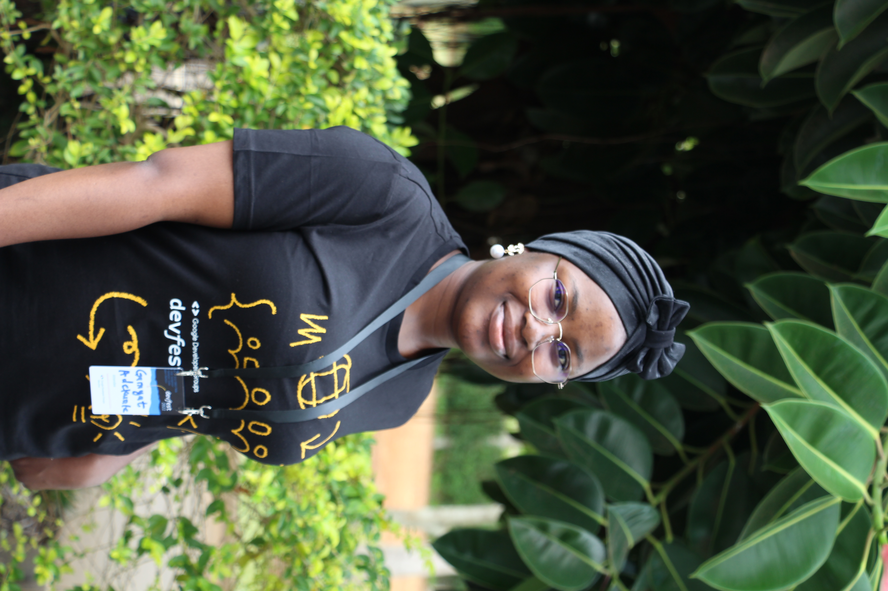

{width=400 height=500}

Hi! I am Ganiyat. I am from Nigeria. I am a data science student at the University of British Columbia with a background in computing, artificial intelligence, and fashion entrepreneurship. Before starting my Master of Data Science, I studied Computing at Glasgow Caledonian University, where I developed interests in machine learning, natural language processing, and human-computer interaction.

