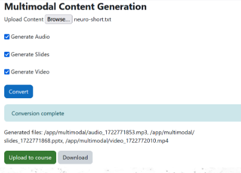
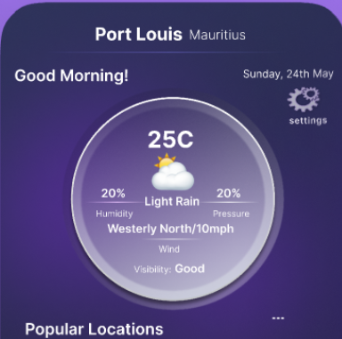

### AdaptEd

An AI-enhanced learning platform for personalised and multimodal learning in higher education. The project uses Python for backend services and PHP for Moodle customizations.
Machine learning models (SVD, TF-IDF, Random Forest) are used for content recommendations.
Natural language processing techniques are employed for the chatbot and content summarization.
The facebook/bart-large-cnn model from HuggingFace Transformers is used for text summarization.

[View on GitHub](https://github.com/Abbiefied/Innovatopedia)

### Purple Sky

A a utilitarian weather application targeting users who require minimal weather information for their day-to-day navigation and schedule. The app provides current weather data, a 3-day weather forecast, air quality information, a weather map with weather icon markers and quality data, the ability to compare weather data between two countries, and the option to add a weather widget to the home screen and weather notifications to the notification bar.

[View on GitHub](https://github.com/Abbiefied/PurpleSky)

