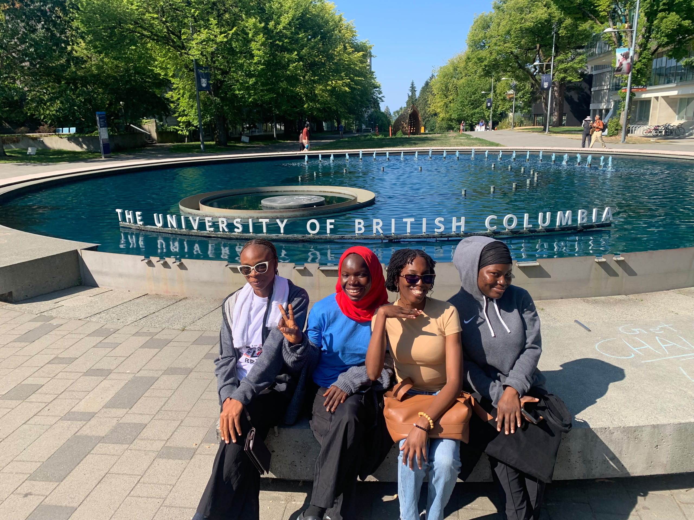

{fig-cap="Scavenger Hunt: Martha Piper Plaza at UBC"}

Starting my Master of Data Science at UBC has been an exciting and slightly overwhelming experience. After spending years studying computing and working on projects involving AI and software development, I was looking forward to finally taking a deeper dive into data science. Orientation and the first days of classes made the transition feel much more real, especially seeing the campus, meeting people from different backgrounds, and beginning this new chapter in Vancouver.

One of the things that has surprised me most is how quickly the program moves. There is a lot to learn, and even familiar topics can feel different when approached from a data science perspective. My first weeks have already involved working with probability, statistics, programming, and data, and I am learning that understanding the reasoning behind a solution is just as important as getting the code to work.

I am still finding my rhythm, but I am excited about what lies ahead. I want to become more confident with the mathematical and statistical foundations of data science while continuing to explore machine learning and AI. For now, I am taking things one week at a time and enjoying the process of becoming a data scientist.

